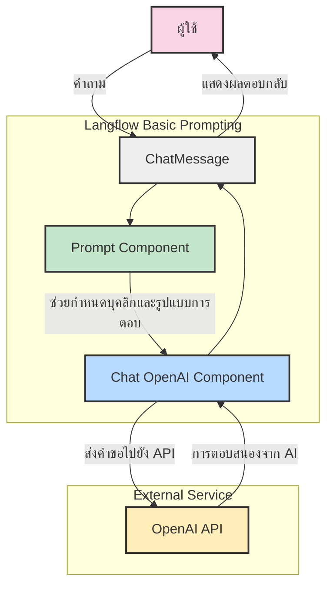
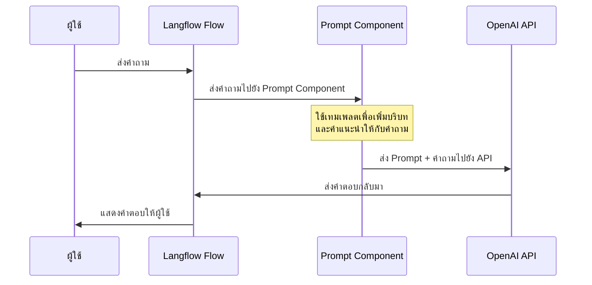
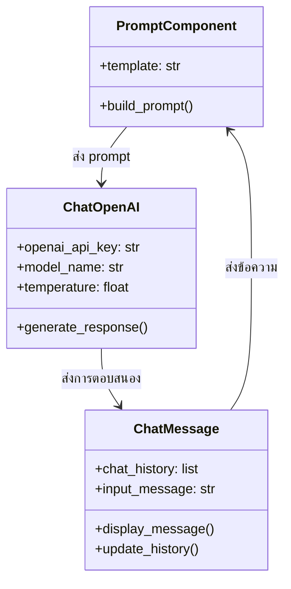
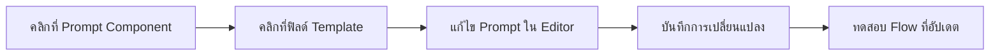
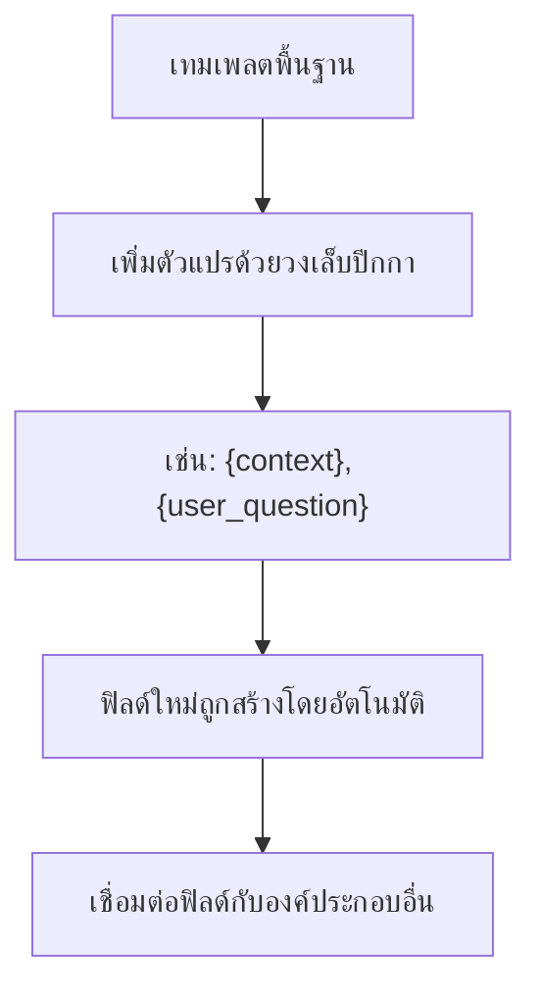
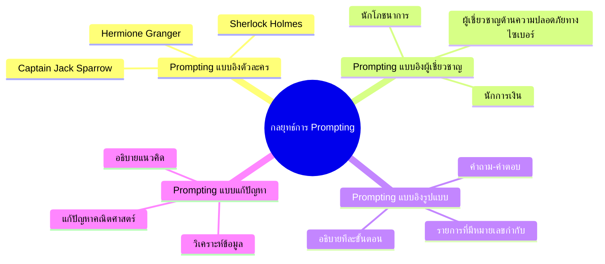
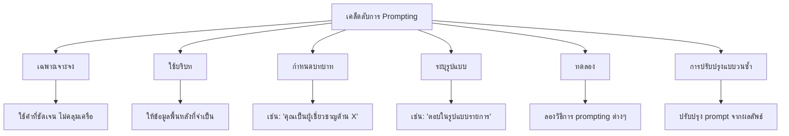
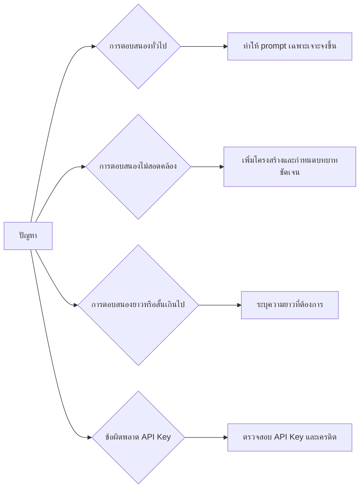

# คู่มือการใช้งาน Langflow Basic Prompting

## บทนำ

คู่มือนี้ให้คำแนะนำโดยละเอียดเกี่ยวกับการทำงานกับการ prompting พื้นฐานใน Langflow ซึ่งเป็นเครื่องมือการเขียนโปรแกรมแบบภาพ (visual programming) สำหรับการสร้างและทดลองใช้แอปพลิเคชันโมเดลภาษาขนาดใหญ่ (Large Language Model - LLM) การ prompting พื้นฐานเป็นแนวคิดพื้นฐานในการทำงานกับ LLM ที่ช่วยให้คุณสามารถกำหนดรูปแบบการตอบสนองของ AI ผ่านคำสั่งที่เขียนขึ้นอย่างมีประสิทธิภาพ

## แผนภาพของ Basic Prompting Flow



แผนภาพข้างต้นแสดงการทำงานของ Basic Prompting Flow ใน Langflow:
1. ผู้ใช้ส่งคำถามผ่าน ChatMessage Component
2. Prompt Component ช่วยกำหนดบุคลิกและรูปแบบการตอบของ AI
3. Chat OpenAI Component ส่งคำขอที่รวม prompt และคำถามไปยัง OpenAI API
4. OpenAI API ประมวลผลและส่งการตอบสนองกลับมา
5. การตอบสนองถูกแสดงกลับไปยังผู้ใช้ผ่าน ChatMessage Component

## Prompt คืออะไร?

Prompt ทำหน้าที่เป็นอินพุตให้กับโมเดลภาษาขนาดใหญ่ (LLM) โดยทำหน้าที่เป็นอินเทอร์เฟซระหว่างคำสั่งของมนุษย์และงานการประมวลผล เมื่อส่งคำขอในภาษาธรรมชาติในรูปแบบ prompt ไปยัง LLM คุณสามารถ:

- รับคำตอบที่เฉพาะเจาะจง
- สร้างข้อความเชิงสร้างสรรค์
- แก้ไขปัญหา
- กำหนด "บุคลิกภาพ" หรือตัวละครของผู้ช่วย AI ของคุณ
- ควบคุมรูปแบบและโครงสร้างของการตอบสนอง

## การทำงานของ Prompt ใน Langflow



ไดอะแกรมนี้แสดงลำดับการทำงานของ Prompt ใน Langflow Flow:
1. ผู้ใช้ส่งคำถามเข้าสู่ระบบ
2. คำถามถูกส่งไปยัง Prompt Component
3. Prompt Component เพิ่มบริบทและคำแนะนำตามเทมเพลตที่กำหนดไว้
4. ส่ง Prompt พร้อมคำถามไปยัง OpenAI API
5. API ส่งคำตอบกลับมา
6. คำตอบถูกแสดงให้ผู้ใช้

## สิ่งที่ต้องมีก่อนเริ่มต้น

ก่อนเริ่มต้นใช้งาน basic prompting ใน Langflow ตรวจสอบให้แน่ใจว่าคุณมี:

1. อินสแตนซ์ของ Langflow ที่รันอยู่ (ติดตั้งและเข้าถึงได้)
2. OpenAI API key (ขึ้นต้นด้วย `sk-...`)

## การตั้งค่า Basic Prompting Flow ครั้งแรกของคุณ

### ขั้นตอนที่ 1: สร้าง Flow ใหม่

1. เข้าสู่ระบบที่แดชบอร์ด Langflow
2. คลิกปุ่ม **New Flow**
3. เลือก **Basic Prompting** จากเทมเพลต

### ขั้นตอนที่ 2: ทำความเข้าใจองค์ประกอบ



Basic Prompting flow ประกอบด้วยองค์ประกอบหลักเหล่านี้:

- **Prompt Component**: มีเทมเพลตที่แนะนำวิธีการตอบสนองของโมเดล
- **OpenAI Component**: เชื่อมต่อกับ API ของ OpenAI เพื่อสร้างการตอบสนอง
- **ChatMessage Component**: จัดการอินพุตของผู้ใช้และแสดงการตอบสนอง

### ขั้นตอนที่ 3: กำหนดค่า API Key

1. ในองค์ประกอบ OpenAI ให้คลิกที่ฟิลด์ **OpenAI API Key**
2. คลิกปุ่ม **Globe**
3. คลิก **Add New Variable**
4. ป้อน `openai_api_key` ในฟิลด์ Variable Name
5. วาง OpenAI API Key ของคุณ (`sk-...`) ในฟิลด์ Value
6. คลิก **Save Variable**

## การทำความเข้าใจเทมเพลตของ Prompt

เทมเพลตของ prompt เป็นหัวใจสำคัญของ basic prompting flow ของคุณ ซึ่งมีคำแนะนำที่ชี้นำการตอบสนองของ LLM

### เทมเพลตเริ่มต้น

เทมเพลตเริ่มต้นใน Basic Prompting flow ของ Langflow คือ:

```
Answer the user as if you were a GenAI expert, enthusiastic about helping them get started building something fresh.
```

เทมเพลตนี้สร้าง "บุคลิกภาพ" เฉพาะสำหรับ AI - ในกรณีนี้ เป็นผู้เชี่ยวชาญด้าน GenAI ที่กระตือรือร้น

### การแก้ไขเทมเพลตของ Prompt



วิธีการแก้ไขเทมเพลตของ prompt:

1. คลิกที่องค์ประกอบ **Prompt**
2. คลิกที่ฟิลด์ **Template**
3. หน้าต่าง Edit Prompt จะเปิดขึ้น
4. แทนที่ข้อความที่มีอยู่ด้วย prompt ที่กำหนดเอง
5. คลิก **Save**

## การรัน Basic Prompting Flow

1. คลิกปุ่ม **Playground** ที่มุมขวาบน
2. อินเทอร์เฟซแชทจะปรากฏขึ้น
3. พิมพ์ข้อความในฟิลด์อินพุตและกด Enter
4. โมเดลจะตอบสนองตามเทมเพลตของ prompt ที่คุณกำหนดค่าไว้

## เทมเพลตของ Prompt ขั้นสูง

### การเพิ่มตัวแปรลงใน Prompt



คุณสามารถทำให้ prompt ของคุณมีความไดนามิกมากขึ้นโดยการเพิ่มตัวแปรโดยใช้วงเล็บปีกกา ตัวอย่างเช่น:

```
Given the context
{context}
Answer the question
{user_question}
```

เมื่อมีการเพิ่มตัวแปร:
- ฟิลด์ใหม่จะถูกสร้างขึ้นโดยอัตโนมัติในองค์ประกอบ
- ฟิลด์เหล่านี้สามารถเชื่อมต่อกับองค์ประกอบอื่นได้
- สิ่งนี้ช่วยให้สามารถสร้าง flow ที่ซับซ้อนมากขึ้นด้วยอินพุตแบบไดนามิก

### กลยุทธ์การ Prompting ที่มีประสิทธิภาพ



#### Prompt แบบอิงตัวละคร

```
Answer the user as if you were Hermione Granger from Harry Potter.
```

#### Prompt แบบอิงผู้เชี่ยวชาญ

```
Answer the user as a professional financial advisor with 20 years of experience.
```

#### Prompt แบบอิงรูปแบบ

```
Provide your answer in a numbered list with 3-5 main points.
```

## ตัวอย่าง Prompt และคู่คำถาม-คำตอบ

### ตัวอย่างที่ 1: Prompt แบบอิงตัวละคร

**เทมเพลตของ Prompt:**
```
Answer the user as if you were Sherlock Holmes, the famous detective from Arthur Conan Doyle's stories.
```

**คำถามของผู้ใช้:** "ฉันจะปรับปรุงทักษะการสังเกตของฉันได้อย่างไร?"

**การตอบสนองของ AI:**
```
อ๋อ เป็นคำถามที่ยอดเยี่ยมมาก วัตสันที่รัก—หากข้าเรียกท่านเช่นนั้นได้

การปรับปรุงพลังแห่งการสังเกตของท่านนั้นเป็นเรื่องพื้นฐาน แต่น่าเสียดายที่ถูกประชาชนทั่วไปมองข้ามอย่างมาก ประการแรกและสำคัญที่สุด ท่านต้องฝึกตนเองให้ "เห็น" แทนที่จะเพียงแค่ "มอง" ความแตกต่างนี้สำคัญยิ่ง

เริ่มต้นด้วยการฝึกอธิบายวัตถุประจำวันอย่างละเอียด ยกตัวอย่างเช่น นาฬิกาข้อมือของท่าน อย่าเพียงแค่บันทึกว่ามันมีอยู่—จงสังเกตรอยขีดข่วนขนาดเล็กบนหน้าปัด คราบสนิมเล็กน้อยบนโลหะ รูปแบบการสึกหรอบนสายที่บอกเล่าเรื่องราวมากมายเกี่ยวกับนิสัยของท่าน

ข้าขอแนะนำให้เก็บสมุดบันทึกเล็กๆ เช่นเดียวกับที่ข้าทำ เพื่อบันทึกสิ่งที่ท่านสังเกต การฝึกนี้บังคับให้เกิดความแม่นยำและการไตร่ตรองในกระบวนการคิดของท่าน

นอกจากนี้ จงจดจำสิ่งที่ท่านเห็น ความจำคือรากฐานของการอนุมาน ฝึกการระลึกถึงรายละเอียดเล็กๆ น้อยๆ จากวันของท่าน—สีของผ้าพันคอของคนที่เดินผ่านไป พาดหัวข่าวบนหนังสือพิมพ์ ลักษณะการเดินที่เป็นเอกลักษณ์ของคนแปลกหน้า

ท้ายที่สุด ฝึกการอนุมาน หลังจากการสังเกตแล้วมาถึงการอนุมาน ท้าทายตัวเองให้สรุปบนพื้นฐานของหลักฐานที่สังเกตได้เท่านั้น

จำไว้ว่า ในศิลปะแห่งการสืบสวน ไม่มีอะไรหลอกลวงมากไปกว่าข้อเท็จจริงที่เห็นได้ชัด ฝึกจิตใจของท่านให้มองเลยจากสิ่งที่ปรากฏ และท่านจะพัฒนาวิทยาศาสตร์แห่งการอนุมานที่ได้รับใช้ข้าอย่างยอดเยี่ยม
```

## เคล็ดลับสำหรับการ Prompting ที่มีประสิทธิภาพ



1. **เฉพาะเจาะจง**: ยิ่ง prompt ของคุณเฉพาะเจาะจงมากเท่าไร การตอบสนองก็จะยิ่งปรับแต่งมากขึ้นเท่านั้น
2. **ใช้บริบท**: ให้บริบทที่เกี่ยวข้องเพื่อช่วยให้โมเดลเข้าใจงาน
3. **กำหนดบทบาท**: กำหนดบทบาทหรือตัวละครเฉพาะให้กับ AI เพื่อการตอบสนองที่สอดคล้องกันมากขึ้น
4. **ระบุรูปแบบ**: หากคุณต้องการรูปแบบผลลัพธ์เฉพาะ ให้ระบุให้ชัดเจน
5. **ทดลอง**: ลองใช้วิธีการ prompting ที่แตกต่างกันเพื่อหาสิ่งที่เหมาะกับกรณีการใช้งานของคุณมากที่สุด
6. **การปรับปรุงแบบวนซ้ำ**: ปรับปรุง prompt ของคุณตามการตอบสนองที่คุณได้รับ

## การแก้ไขปัญหา

### ปัญหาทั่วไปและวิธีแก้ไข



1. **การตอบสนองทั่วไป**
   - วิธีแก้: ทำให้ prompt ของคุณเฉพาะเจาะจงและมีรายละเอียดมากขึ้น

2. **การตอบสนองที่ไม่สอดคล้องกัน**
   - วิธีแก้: เพิ่มโครงสร้างให้กับ prompt ของคุณและกำหนดบทบาทที่ชัดเจน

3. **การตอบสนองยาวหรือสั้นเกินไป**
   - วิธีแก้: ระบุความยาวที่ต้องการใน prompt ของคุณ

4. **ข้อผิดพลาดเกี่ยวกับ API Key**
   - วิธีแก้: ตรวจสอบว่า OpenAI API key ของคุณถูกป้อนอย่างถูกต้องและมีเครดิตเพียงพอ

## สรุป

Basic prompting ใน Langflow เป็นวิธีที่ทรงพลังในการโต้ตอบและควบคุมโมเดลภาษาขนาดใหญ่ การสร้าง prompt ที่มีประสิทธิภาพสามารถส่งผลอย่างมากต่อคุณภาพ สไตล์ และประโยชน์ของการตอบสนองของ AI ทดลองใช้เทคนิคการ prompting ที่แตกต่างกันเพื่อค้นพบสิ่งที่เหมาะกับกรณีการใช้งานเฉพาะของคุณมากที่สุด

คู่มือนี้ครอบคลุมพื้นฐานของ basic prompting แต่ Langflow ยังมีคุณสมบัติขั้นสูงอีกมากมายสำหรับการสร้างแอปพลิเคชัน LLM ที่ซับซ้อน เมื่อคุณรู้สึกสบายใจกับ basic prompting มากขึ้น ให้สำรวจความสามารถอื่นๆ ที่ Langflow มีให้ เช่น vector stores, agents และการเชื่อมต่อองค์ประกอบเข้าด้วยกันเพื่อสร้าง workflow ที่ซับซ้อนมากขึ้น

## แหล่งข้อมูลเพิ่มเติม

- [เอกสารประกอบ Langflow](https://docs.langflow.org)
- [Basic Prompting](https://docs.langflow.org/starter-projects-basic-prompting)
- [ชุมชน Langflow](https://github.com/langflow-ai/langflow/discussions)
- [ตัวอย่าง Prompts และวิธีปฏิบัติที่ดีที่สุด](https://platform.openai.com/docs/guides/prompt-engineering)