# คู่มือการใช้งาน Langflow Vector Store RAG

## บทนำ

คู่มือนี้อธิบายการใช้งาน Vector Store RAG (Retrieval Augmented Generation) ใน Langflow ซึ่งเป็นเทคนิคที่ช่วยปรับปรุงความสามารถของโมเดลภาษาขนาดใหญ่ (LLM) โดยการค้นคืนข้อมูลที่เกี่ยวข้องจากฐานข้อมูลเวกเตอร์มาใช้เป็นบริบทเพิ่มเติม ทำให้ LLM สามารถตอบคำถามโดยอ้างอิงข้อมูลเฉพาะได้แม่นยำยิ่งขึ้น

## แผนภาพภาพรวมของ Vector Store RAG

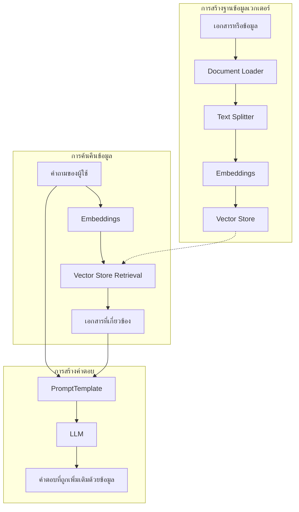

แผนภาพข้างต้นแสดงการทำงานของระบบ Vector Store RAG ซึ่งประกอบด้วย 3 ส่วนหลัก:
1. **การสร้างฐานข้อมูลเวกเตอร์**: เอกสารถูกโหลด แบ่งเป็นชิ้นส่วน และแปลงเป็นเวกเตอร์เพื่อจัดเก็บในฐานข้อมูลเวกเตอร์
2. **การค้นคืนข้อมูล**: คำถามของผู้ใช้ถูกแปลงเป็นเวกเตอร์เพื่อค้นหาเอกสารที่เกี่ยวข้อง
3. **การสร้างคำตอบ**: เอกสารที่ค้นคืนมาและคำถามถูกนำไปสร้างคำตอบโดย LLM

## RAG คืออะไร?

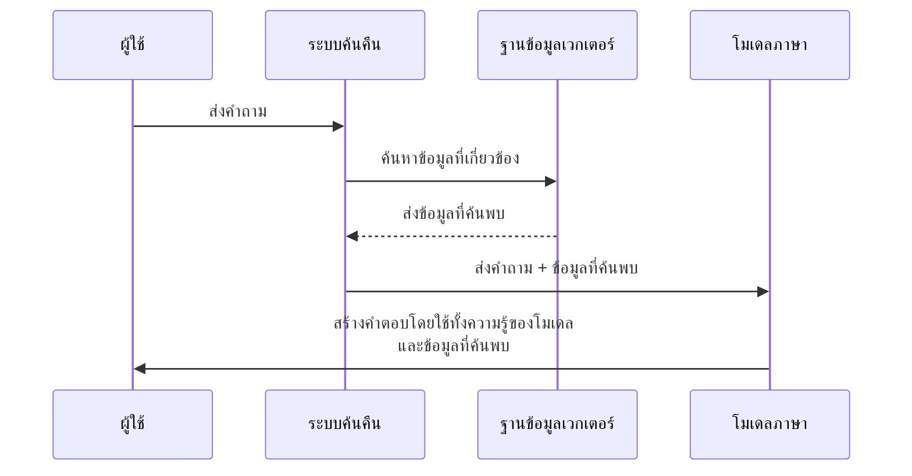

Retrieval Augmented Generation (RAG) เป็นเทคนิคที่รวมกระบวนการค้นคืนข้อมูล (Retrieval) เข้ากับการสร้างเนื้อหา (Generation) โดย:

1. **ค้นคืนข้อมูลที่เกี่ยวข้อง**: เมื่อผู้ใช้ตั้งคำถาม ระบบจะค้นหาข้อมูลที่เกี่ยวข้องจากฐานข้อมูลเวกเตอร์
2. **เพิ่มบริบท**: ข้อมูลที่ค้นคืนมาจะถูกใช้เป็นบริบทเพิ่มเติมสำหรับ LLM
3. **สร้างคำตอบ**: LLM จะสร้างคำตอบโดยใช้ทั้งความรู้ที่มีอยู่และข้อมูลที่ค้นคืนมา

ข้อดีของ RAG:
- ช่วยให้ LLM ตอบคำถามโดยอ้างอิงข้อมูลที่ทันสมัยและเฉพาะเจาะจง
- ลดปัญหา "hallucination" หรือการสร้างข้อมูลที่ไม่ถูกต้อง
- อนุญาตให้ LLM เข้าถึงข้อมูลนอกเหนือจากชุดข้อมูลฝึกอบรมเดิม

## การเปรียบเทียบ LLM ทั่วไปกับ RAG

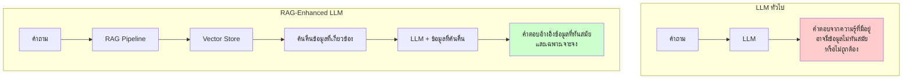

## สิ่งที่ต้องมีก่อนเริ่มต้น

ก่อนเริ่มต้นใช้งาน Vector Store RAG ใน Langflow ตรวจสอบให้แน่ใจว่าคุณมี:

1. อินสแตนซ์ของ Langflow ที่รันอยู่
2. OpenAI API key (เริ่มต้นด้วย `sk-...`)
3. บัญชี DataStax Astra DB (สำหรับใช้เป็นฐานข้อมูลเวกเตอร์) หรือใช้ฐานข้อมูลเวกเตอร์อื่น เช่น FAISS (ไม่ต้องการการเชื่อมต่อกับบริการภายนอก)

## การสร้าง Vector Store RAG Flow

### ขั้นตอนที่ 1: เปิด Langflow และเริ่มโปรเจกต์ใหม่

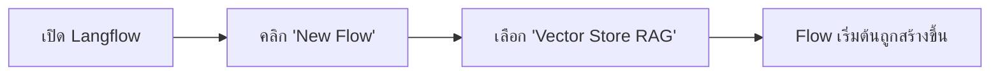

1. เข้าสู่ระบบที่แดชบอร์ด Langflow
2. คลิกปุ่ม **New Flow**
3. เลือก **Vector Store RAG** จากเทมเพลต

### ขั้นตอนที่ 2: ทำความเข้าใจองค์ประกอบหลัก

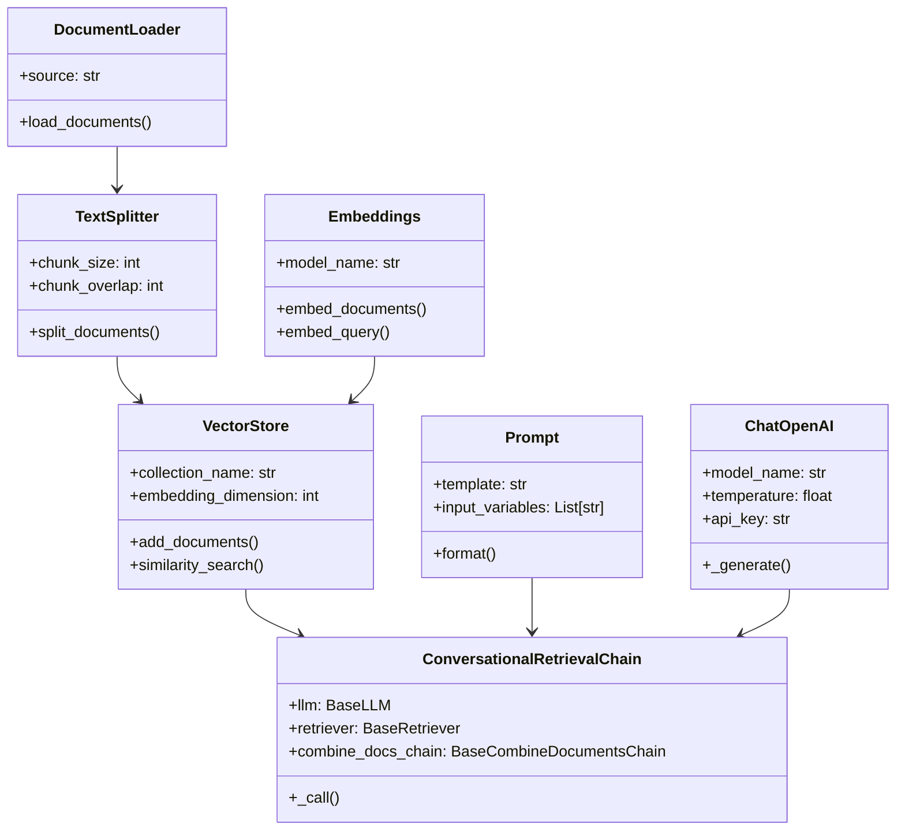

Vector Store RAG flow ประกอบด้วยองค์ประกอบหลักต่อไปนี้:

1. **OpenAI** - เชื่อมต่อกับ API ของ OpenAI เพื่อใช้โมเดลภาษา
2. **Embeddings** - สร้างเวกเตอร์ (vector embeddings) จากข้อความ
3. **AstraDB/FAISS/อื่นๆ** - ฐานข้อมูลเวกเตอร์สำหรับเก็บและค้นคืนข้อมูล
4. **Document Loader** - โหลดเอกสารเพื่อนำเข้าฐานข้อมูล
5. **Text Splitter** - แบ่งเอกสารเป็นชิ้นส่วนที่เหมาะสมสำหรับการวิเคราะห์
6. **Prompt** - กำหนดโครงสร้างของคำถามและคำตอบ
7. **ConversationalRetrievalChain** - เชื่อมโยงการค้นคืนและการสนทนาเข้าด้วยกัน

### ขั้นตอนที่ 3: การกำหนดค่าองค์ประกอบ

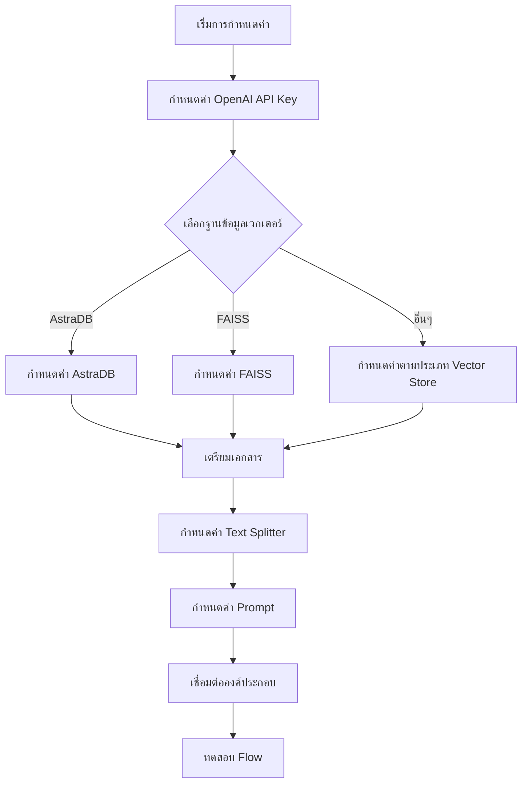

#### กำหนดค่า OpenAI
1. คลิกที่องค์ประกอบ **OpenAI**
2. ในฟิลด์ **OpenAI API Key** คลิกปุ่ม **Globe**
3. คลิก **Add New Variable**
4. ป้อน `openai_api_key` ในฟิลด์ Variable Name
5. วาง OpenAI API Key ของคุณในฟิลด์ Value
6. คลิก **Save Variable**

#### กำหนดค่า Vector Store (ตัวอย่างใช้ FAISS)
1. คลิกที่องค์ประกอบ **FAISS**
2. กำหนดค่าพารามิเตอร์ที่จำเป็น:
   - **Index Name** - ชื่อของดัชนี FAISS (เช่น "langflow_index")
   - **Persist Directory** - ไดเรกทอรีสำหรับบันทึกดัชนี FAISS (เช่น "./faiss_index")

#### กำหนดค่า Document Loader
1. คลิกที่องค์ประกอบ **Document Loader**
2. เลือกประเภทของเอกสารที่ต้องการโหลด (เช่น Webpage, PDF, CSV)
3. ป้อน URL หรืออัปโหลดไฟล์ตามที่ต้องการ

#### กำหนดค่า Text Splitter
1. คลิกที่องค์ประกอบ **Text Splitter**
2. กำหนดค่า **Chunk Size** (ขนาดของชิ้นส่วนข้อความที่แบ่ง เช่น 500)
3. กำหนดค่า **Chunk Overlap** (จำนวนตัวอักษรที่ซ้อนกันระหว่างชิ้นส่วน เช่น 50)

#### กำหนดค่า Prompt
1. คลิกที่องค์ประกอบ **Prompt**
2. แก้ไขเทมเพลตตามที่ต้องการ เช่น:
```
Given the context:
{context}

Answer the question: {question}

Use only the context provided. If you don't know the answer based on the context, say "I don't know".
```

### ขั้นตอนที่ 4: เชื่อมต่อองค์ประกอบ

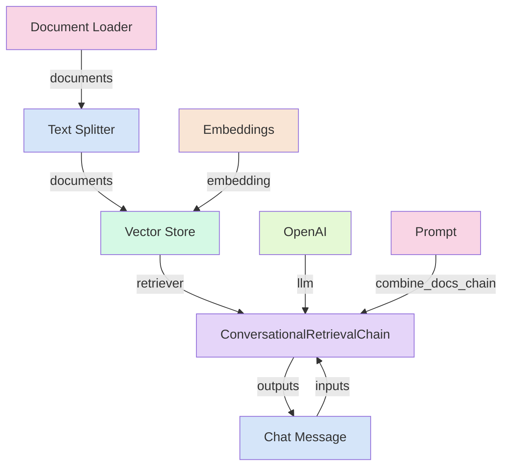

เชื่อมต่อองค์ประกอบต่างๆ เข้าด้วยกัน:

1. เชื่อมต่อ **Document Loader** ไปยัง **Text Splitter**
2. เชื่อมต่อ **Text Splitter** ไปยัง **Vector Store** (ที่พอร์ต `documents`)
3. เชื่อมต่อ **Embeddings** ไปยัง **Vector Store** (ที่พอร์ต `embedding`)
4. เชื่อมต่อ **Vector Store** ไปยัง **ConversationalRetrievalChain** (ที่พอร์ต `retriever`)
5. เชื่อมต่อ **OpenAI** ไปยัง **ConversationalRetrievalChain** (ที่พอร์ต `llm`)
6. เชื่อมต่อ **Prompt** ไปยัง **ConversationalRetrievalChain** (ที่พอร์ต `combine_docs_chain`)

## ตัวอย่างโครงสร้าง Vector Store RAG Flow ใน Langflow

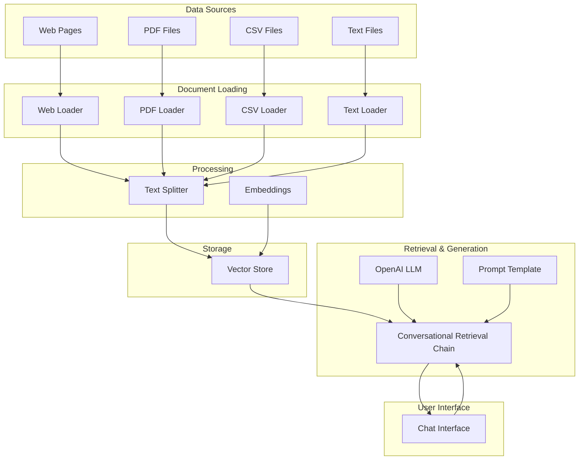

## กระบวนการทำงานของ Vector Store RAG ในรายละเอียด

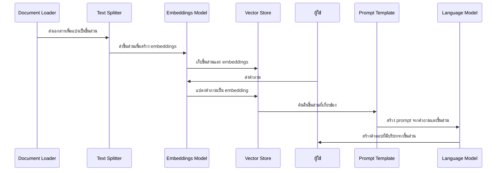

## การใช้ Vector Store อื่นๆ

นอกจาก FAISS แล้ว Langflow ยังรองรับ Vector Store อื่นๆ ดังนี้:

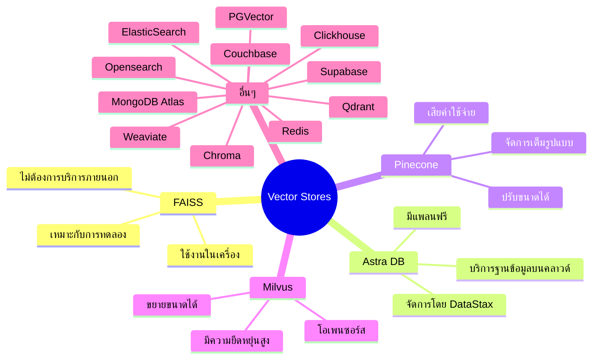

### การเลือก Vector Store ที่เหมาะสม

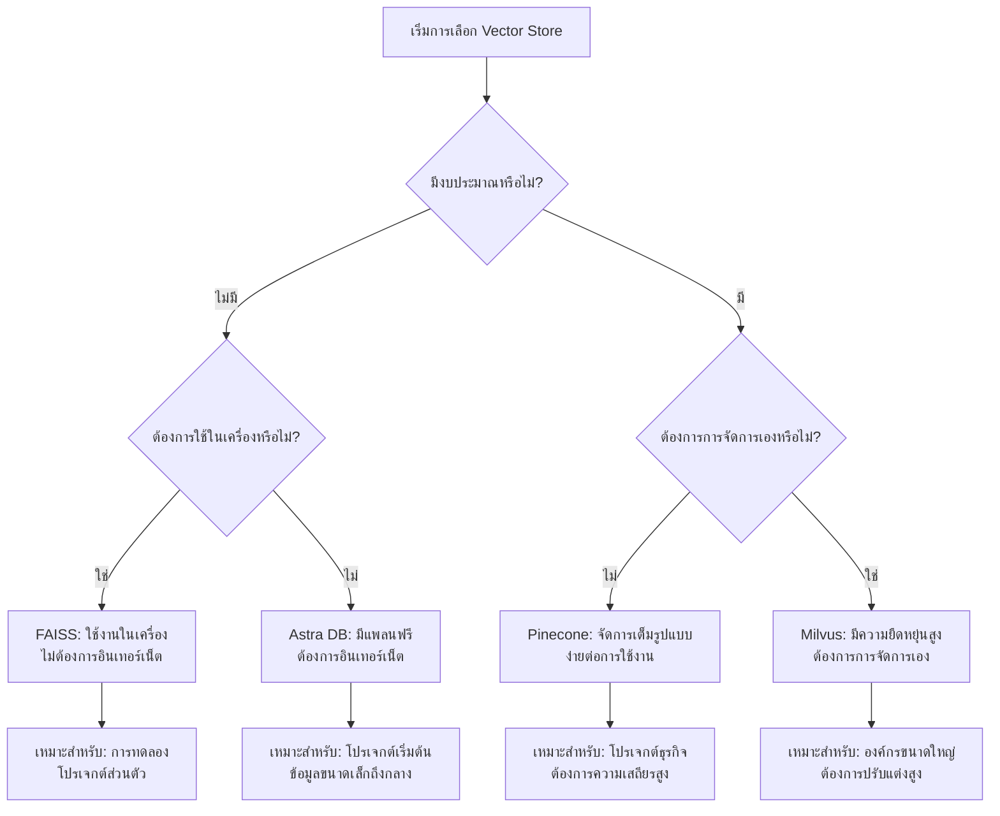

## เคล็ดลับและเทคนิคเพิ่มเติม

### การปรับปรุงคุณภาพของผลลัพธ์

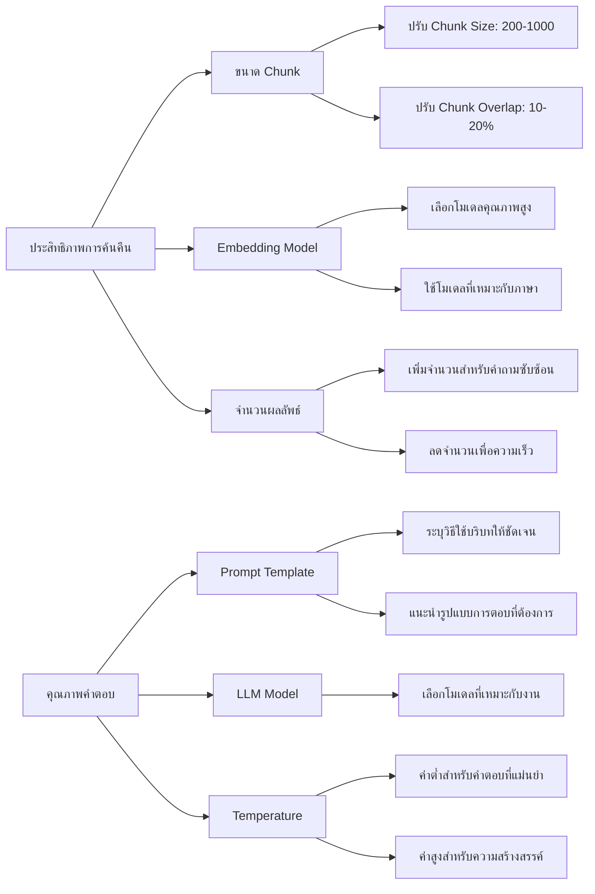

1. **การปรับแต่ง Text Splitter**:
   - ปรับ Chunk Size ให้เหมาะกับข้อมูลของคุณ
   - เพิ่ม Chunk Overlap เพื่อรักษาบริบทระหว่างชิ้นส่วน

2. **การใช้ Embeddings ที่เหมาะสม**:
   - โมเดล Embeddings ที่ดีกว่าจะให้ผลการค้นคืนที่แม่นยำกว่า
   - ทดลองใช้โมเดลต่างๆ เช่น OpenAI's text-embedding-ada-002 หรือ BERT

3. **การปรับแต่ง Prompt**:
   - ให้คำแนะนำที่ชัดเจนว่า AI ควรตอบอย่างไร
   - ระบุว่า AI ควรใช้เฉพาะข้อมูลที่ให้มาและหลีกเลี่ยงการสร้างข้อมูลที่ไม่มีในบริบท

4. **การปรับแต่งพารามิเตอร์การค้นคืน**:
   - เพิ่มจำนวนผลลัพธ์ที่ค้นคืน (Number of Results) สำหรับคำถามที่ซับซ้อน
   - ปรับ Score Threshold เพื่อควบคุมความเกี่ยวข้องของผลลัพธ์

### การแก้ไขปัญหาทั่วไป

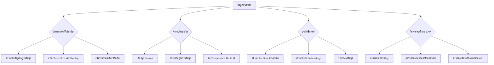

1. **ข้อมูลขนาดใหญ่**:
   - แบ่งเอกสารขนาดใหญ่เป็นส่วนย่อยๆ ก่อนนำเข้า
   - พิจารณาใช้ฐานข้อมูลเวกเตอร์ที่ขยายขนาดได้สำหรับข้อมูลขนาดใหญ่

2. **ความถูกต้องของคำตอบ**:
   - ตรวจสอบว่า Prompt รวมคำแนะนำให้ AI อ้างอิงเฉพาะข้อมูลที่มีอยู่
   - เพิ่มคำแนะนำให้ AI ระบุเมื่อไม่มีข้อมูลเพียงพอในบริบท

3. **ประสิทธิภาพ**:
   - ใช้ฐานข้อมูลเวกเตอร์ที่เหมาะสมกับขนาดข้อมูลของคุณ
   - พิจารณาลดมิติของ embeddings สำหรับชุดข้อมูลขนาดใหญ่มาก

## สรุป

Vector Store RAG ใน Langflow เป็นเครื่องมือที่ทรงพลังในการสร้าง AI แชทบอทที่อ้างอิงข้อมูลเฉพาะได้อย่างแม่นยำ โดยการรวม LLM เข้ากับฐานข้อมูลเวกเตอร์ คุณสามารถสร้างแอปพลิเคชันที่:

- ตอบคำถามโดยอ้างอิงข้อมูลที่คุณกำหนด
- ลดการสร้างข้อมูลที่ไม่ถูกต้อง (hallucination)
- อัปเดตความรู้ได้โดยไม่ต้องฝึกอบรมโมเดลใหม่
- ให้คำตอบที่มีความเฉพาะเจาะจงสูงและเชื่อถือได้

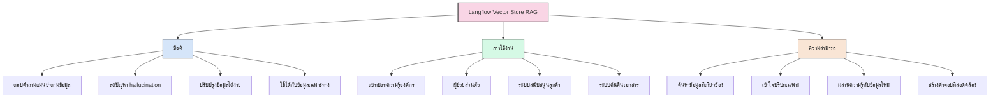

ด้วยการปรับแต่งองค์ประกอบที่เหมาะสม คุณสามารถปรับแต่ง RAG system ให้ตอบสนองความต้องการเฉพาะของคุณได้ ไม่ว่าจะเป็นการสร้างผู้ช่วยส่วนตัว, ระบบ knowledge base, หรือแชทบอทสำหรับเอกสารเฉพาะทาง

## แหล่งข้อมูลเพิ่มเติม

- [Langflow Documentation](https://docs.langflow.org)
- [Vector Store Components](https://docs.langflow.org/components-vector-stores)
- [Starter Projects: Vector Store RAG](https://docs.langflow.org/starter-projects-vector-store-rag)
- [DataStax Astra DB Documentation](https://docs.datastax.com/en/astra-db/docs/)