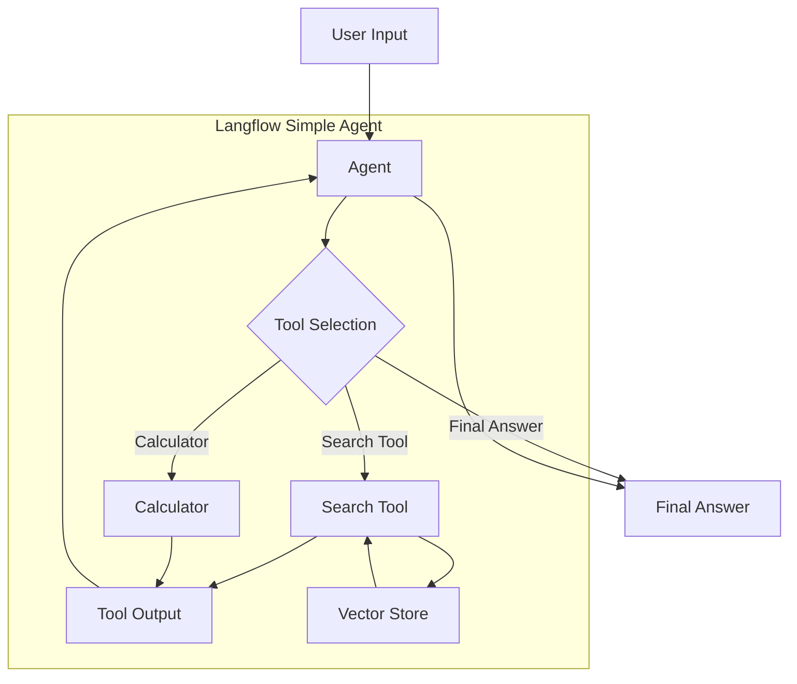

# ระบบ RAG (Retrieval Augmented Generation) สำหรับข้อมูลอาหารไทย

## บทนำ

โปรเจคนี้เป็นตัวอย่างการใช้งาน RAG (Retrieval Augmented Generation) กับข้อมูลอาหารไทย โดยใช้ Langflow ซึ่งเป็นเครื่องมือ No-code สำหรับสร้าง LLM Application แบบ drag-and-drop โปรเจคนี้จะแสดงวิธีการสร้าง Simple Agent ที่สามารถตอบคำถามเกี่ยวกับอาหารไทย วัตถุดิบ วิธีทำ และประวัติความเป็นมาได้

## แผนภาพการทำงานของ RAG

```mermaid
flowchart TD
    A[เตรียมข้อมูล] --> B[การประมวลผลข้อมูล]
    B --> C[Embedding & Vector Store]
    D[คำถามผู้ใช้] --> E[คำนวณ Embedding]
    E --> F[ค้นหาข้อมูลที่เกี่ยวข้อง]
    C --> F
    F --> G[แทรกบริบทในคำถาม - Prompt]
    G --> H[ส่งให้ LLM ประมวลผล]
    H --> I[คำตอบแบบมีบริบท]
    
    subgraph ข้อมูล
    A
    end
    
    subgraph การจัดเตรียมบริบท
    B
    C
    F
    end
    
    subgraph การโต้ตอบ
    D
    E
    G
    H
    I
    end
```

แผนภาพข้างต้นแสดงการทำงานของระบบ RAG ซึ่งประกอบด้วย 3 ส่วนหลัก:

1. **ข้อมูล**: การเตรียมข้อมูลอาหารไทยที่จะใช้เป็นแหล่งความรู้
2. **การจัดเตรียมบริบท**: กระบวนการแปลงข้อมูลเป็น Vector และการค้นหาข้อมูลที่เกี่ยวข้อง
3. **การโต้ตอบ**: การรับคำถาม ค้นหาข้อมูล และสร้างคำตอบที่มีบริบท

## แผนภาพการทำงานของ Simple Agent ใน Langflow



แผนภาพนี้แสดงการทำงานของ Simple Agent ใน Langflow โดย:
- Agent รับคำถามจากผู้ใช้
- เลือกใช้ Tool ที่เหมาะสม เช่น Search Tool หรือ Calculator
- Tool ที่เลือกจะค้นหาข้อมูลจาก Vector Store หรือทำการคำนวณ
- นำผลลัพธ์จาก Tool มาสร้างคำตอบสุดท้ายให้ผู้ใช้

## โครงสร้างไฟล์

```
hand-on_2-3/
├── data/
│   ├── thai_food_information.txt  # ข้อมูลเกี่ยวกับอาหารไทย 10 ชนิด
│   └── thai_ingredients.txt       # ข้อมูลเกี่ยวกับวัตถุดิบและเครื่องปรุงอาหารไทย
├── questions.txt                  # ชุดคำถาม 10 ข้อสำหรับทดสอบระบบ RAG
├── prompt.txt                     # Prompt แบบ Dynamic สำหรับใช้กับระบบ RAG
├── langflow_rag_guide.md          # คู่มือการใช้งาน RAG บน Langflow
├── simple_agent_explanation.md    # เอกสารอธิบายการทำงานของ Simple Agent
└── README.md                      # ไฟล์นี้
```

## วิธีการใช้งาน

1. **เตรียมข้อมูล**:
   โปรเจคนี้มีข้อมูลพร้อมใช้งานในโฟลเดอร์ `data/` ซึ่งประกอบด้วยข้อมูลเกี่ยวกับอาหารไทยและวัตถุดิบ

2. **ติดตั้ง Langflow**:
   ทำตามคำแนะนำในเว็บไซต์ [Langflow Documentation](https://docs.langflow.org) เพื่อติดตั้ง Langflow

3. **สร้าง Flow ใน Langflow**:
   - เปิด Langflow ในเบราว์เซอร์
   - สร้าง Flow ใหม่หรือใช้ Simple Agent Template
   - ตั้งค่าส่วนประกอบต่างๆ ตามคำแนะนำในไฟล์ `langflow_rag_guide.md`

4. **ทดสอบระบบ**:
   - Deploy Flow ที่สร้างขึ้น
   - ใช้คำถามจากไฟล์ `questions.txt` เพื่อทดสอบระบบ

## Prompt ที่ใช้

Prompt ในไฟล์ `prompt.txt` ถูกออกแบบมาให้:
- กำหนดบทบาทเป็นผู้เชี่ยวชาญด้านอาหารไทย
- แนะนำให้ใช้ข้อมูลที่มีอยู่ในการตอบคำถาม
- ตอบคำถามอย่างละเอียดและเป็นขั้นตอน
- แจ้งเมื่อไม่มีข้อมูลเพียงพอ

## คำถามตัวอย่าง

ชุดคำถามในไฟล์ `questions.txt` ประกอบด้วยคำถามเกี่ยวกับ:
- วัตถุดิบและวิธีการทำอาหารไทย
- ประวัติความเป็นมาของอาหารไทย
- สรรพคุณของสมุนไพรไทย
- ความแตกต่างระหว่างอาหารไทยชนิดต่างๆ

## แหล่งข้อมูลเพิ่มเติม

- [Langflow Documentation](https://docs.langflow.org)
- [Starter Projects: Simple Agent](https://docs.langflow.org/starter-projects-simple-agent)
- [คู่มือการใช้งาน RAG](langflow_rag_guide.md)
- [คำอธิบายการทำงานของ Simple Agent](simple_agent_explanation.md)

## หมายเหตุ

แผนภาพในเอกสารนี้สร้างด้วย Mermaid ซึ่งเป็น JavaScript library สำหรับสร้างแผนภาพจากข้อความ คุณสามารถดูแผนภาพเหล่านี้ได้ใน GitHub หรือเว็บไซต์ที่สนับสนุนการแสดงผล Mermaid