# คู่มือการใช้งาน Langflow Simple Agent สำหรับข้อมูลอาหารไทย

## บทนำ

คู่มือนี้อธิบายการสร้างและใช้งาน Simple Agent ใน Langflow โดยประยุกต์ใช้กับข้อมูลอาหารไทย Simple Agent เป็นแอปพลิเคชัน AI ที่สามารถเลือกใช้เครื่องมือต่างๆ เพื่อตอบคำถามและแก้ปัญหาได้อย่างอัตโนมัติ โดยใช้โมเดลภาษาขนาดใหญ่ (LLM) เป็น "สมอง" ในการวิเคราะห์และตัดสินใจ โปรเจกต์นี้จะแสดงวิธีการสร้าง Simple Agent ที่สามารถตอบคำถามเกี่ยวกับอาหารไทย วัตถุดิบ วิธีทำ และประวัติความเป็นมาได้

## การทำงานของ Simple Agent


แผนภาพข้างต้นแสดงการทำงานของ Simple Agent โดย:
1. ผู้ใช้ส่งคำถามเข้ามา
2. Agent วิเคราะห์คำถามและตัดสินใจเลือกใช้ Tool ที่เหมาะสม
3. Tool ทำงานและส่งผลลัพธ์กลับไปให้ Agent
4. Agent ประมวลผลข้อมูลและสร้างคำตอบสุดท้ายส่งกลับไปให้ผู้ใช้

## องค์ประกอบของ Simple Agent


## การทำงานของ Agent แบบละเอียด

```mermaid
sequenceDiagram
    participant User as ผู้ใช้
    participant Agent as Tool Calling Agent
    participant Search as Search Tool
    participant Vector as Vector Store
    participant Calc as Calculator Tool
    
    User->>Agent: ถามคำถามเกี่ยวกับอาหารไทย
    Agent->>Agent: วิเคราะห์คำถามและเขียน Thought
    
    alt ต้องการข้อมูลเฉพาะ
        Agent->>Search: เลือกใช้ Search Tool
        Search->>Vector: ค้นหาข้อมูลอาหารไทยที่เกี่ยวข้อง
        Vector-->>Search: ส่งข้อมูลที่เกี่ยวข้อง
        Search-->>Agent: ส่งผลการค้นหา (Observation)
        Agent->>Agent: วิเคราะห์ข้อมูลที่ได้รับและเขียน Thought ใหม่
    else ต้องการคำนวณ
        Agent->>Calc: เลือกใช้ Calculator Tool
        Calc-->>Agent: ส่งผลการคำนวณ (Observation)
        Agent->>Agent: วิเคราะห์ผลการคำนวณและเขียน Thought ใหม่
    end
    
    Agent->>Agent: ตัดสินใจว่ามีข้อมูลเพียงพอหรือต้องใช้ Tool เพิ่มเติม
    
    opt ต้องการข้อมูลเพิ่มเติม
        Agent->>Search: ใช้ Search Tool อีกครั้ง
        Search->>Vector: ค้นหาข้อมูลเพิ่มเติม
        Vector-->>Search: ส่งข้อมูลเพิ่มเติม
        Search-->>Agent: ส่งผลการค้นหา (Observation)
        Agent->>Agent: วิเคราะห์ข้อมูลเพิ่มเติมและเขียน Thought ใหม่
    end
    
    Agent->>User: สร้างคำตอบสุดท้ายจากข้อมูลที่รวบรวมได้
```



## โครงสร้างของ Simple Agent Flow ใน Langflow


## องค์ประกอบหลักของ Simple Agent Flow


## กระบวนการคิดของ Simple Agent

การทำงานของ Simple Agent สามารถแสดงเป็นกระบวนการคิดได้ดังนี้:


## ขั้นตอนการสร้าง Simple Agent สำหรับข้อมูลอาหารไทย

### ขั้นตอนที่ 1: เตรียมข้อมูลอาหารไทย


โปรเจคนี้มีข้อมูลพร้อมใช้งานในโฟลเดอร์ `data/` ซึ่งประกอบด้วย:
- `thai_food_information.txt`: ข้อมูลเกี่ยวกับอาหารไทย 10 ชนิด
- `thai_ingredients.txt`: ข้อมูลเกี่ยวกับวัตถุดิบและเครื่องปรุงอาหารไทย

### ขั้นตอนที่ 2: เปิด Langflow และเริ่มต้นโปรเจกต์


1. เปิด Langflow ในเบราว์เซอร์
2. คลิกปุ่ม **New Flow**
3. เลือก **Simple Agent** จากรายการ Template

### ขั้นตอนที่ 3: ปรับแต่งองค์ประกอบหลัก


### ขั้นตอนที่ 4: เชื่อมต่อองค์ประกอบ


### ขั้นตอนที่ 5: ปรับแต่ง System Prompt


ตัวอย่าง System Prompt:

```
คุณเป็นผู้เชี่ยวชาญด้านอาหารไทย ที่มีความรู้เกี่ยวกับอาหารไทยแท้ดั้งเดิม วัตถุดิบ วิธีการทำ และประวัติความเป็นมา

คุณมีเครื่องมือต่างๆ ที่สามารถใช้ช่วยในการตอบคำถามได้:
1. Search Tool - ใช้ค้นหาข้อมูลเกี่ยวกับอาหารไทย วัตถุดิบ และวิธีการทำ 
2. Calculator - ใช้คำนวณปริมาณส่วนผสม การแปลงหน่วย หรือคุณค่าทางโภชนาการ

ในการตอบคำถาม:
- ใช้ข้อมูลที่ถูกต้องและอ้างอิงจากแหล่งข้อมูลที่มี
- อธิบายอย่างละเอียดและเป็นขั้นตอน
- หากมีหลายวิธี ให้ระบุทางเลือกต่างๆ
- หากไม่มีข้อมูลเพียงพอ ให้แจ้งว่าไม่มีข้อมูล

เมื่อตอบคำถามเกี่ยวกับวิธีทำอาหาร ให้แสดงส่วนผสมและขั้นตอนอย่างชัดเจน
```

## การทำงานของ Simple Agent ในแต่ละขั้นตอน


## ตัวอย่างคำถามและวิธีการคิดของ Agent

### ตัวอย่างที่ 1: "วัตถุดิบหลักในการทำต้มยำกุ้งมีอะไรบ้าง?"


### ตัวอย่างที่ 2: "ถ้าต้องทำต้มยำกุ้งสำหรับ 5 คน ต้องใช้กุ้งกี่ตัว?"


## เทคนิคการปรับแต่ง Prompt เพื่อประสิทธิภาพที่ดีขึ้น


## ข้อแนะนำในการพัฒนา Simple Agent ให้ดียิ่งขึ้น


## แหล่งข้อมูลเพิ่มเติม


## โครงสร้างไฟล์ของโปรเจกต์

```
hand-on_2-3/
├── data/
│   ├── thai_food_information.txt  # ข้อมูลเกี่ยวกับอาหารไทย 10 ชนิด
│   └── thai_ingredients.txt       # ข้อมูลเกี่ยวกับวัตถุดิบและเครื่องปรุงอาหารไทย
├── questions.txt                  # ชุดคำถาม 10 ข้อสำหรับทดสอบระบบ 
├── prompt.txt                     # Prompt แบบ Dynamic สำหรับใช้กับระบบ
├── langflow_rag_guide.md          # คู่มือการใช้งาน RAG บน Langflow
├── simple_agent_explanation.md    # เอกสารอธิบายการทำงานของ Simple Agent
└── README_TH.md                   # ไฟล์นี้
```

## สรุป


Simple Agent ใน Langflow เป็นเครื่องมือที่ทรงพลังสำหรับการสร้างแอปพลิเคชัน AI ที่สามารถแก้ปัญหาและตอบคำถามได้โดยอัตโนมัติ ด้วยการรวม Simple Agent เข้ากับเทคโนโลยี RAG และข้อมูลอาหารไทย ทำให้เราสามารถสร้างแชทบอทที่:

- ตอบคำถามเกี่ยวกับอาหารไทยได้อย่างแม่นยำ
- เลือกใช้เครื่องมือที่เหมาะสมกับคำถามแต่ละประเภท
- ให้ข้อมูลเชิงลึกเกี่ยวกับวัตถุดิบ วิธีการทำ และประวัติความเป็นมา
- สามารถคำนวณปริมาณส่วนผสมและปรับสูตรอาหารได้

คู่มือนี้ได้อธิบายการสร้าง Simple Agent สำหรับข้อมูลอาหารไทย ซึ่งสามารถนำไปประยุกต์ใช้กับข้อมูลประเภทอื่นๆ ได้เช่นกัน

## แหล่งข้อมูลเพิ่มเติม

- [Langflow Documentation](https://docs.langflow.org)
- [Starter Projects: Simple Agent](https://docs.langflow.org/starter-projects-simple-agent)
- [คู่มือการใช้งาน RAG](langflow_rag_guide.md)
- [คำอธิบายการทำงานของ Simple Agent](simple_agent_explanation.md)

## หมายเหตุ

แผนภาพในเอกสารนี้สร้างด้วย Mermaid ซึ่งเป็น JavaScript library สำหรับสร้างแผนภาพจากข้อความ คุณสามารถดูแผนภาพเหล่านี้ได้ใน GitHub หรือเว็บไซต์ที่สนับสนุนการแสดงผล Mermaid เช่น GitHub, GitLab หรือเว็บไซต์ที่มีปลั๊กอิน Mermaid