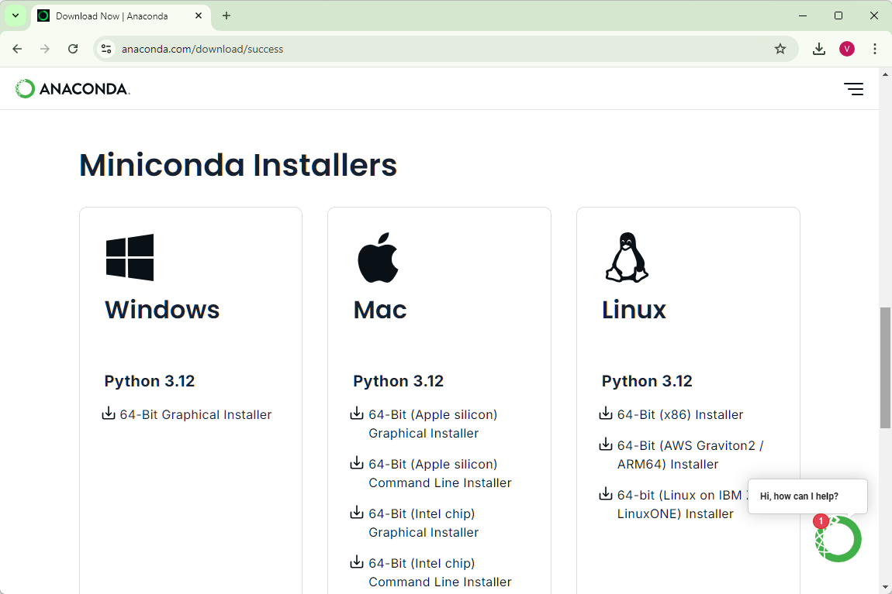
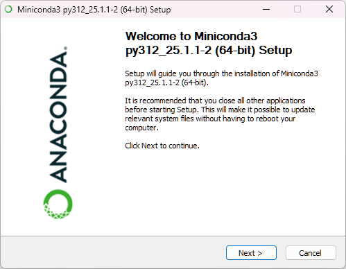
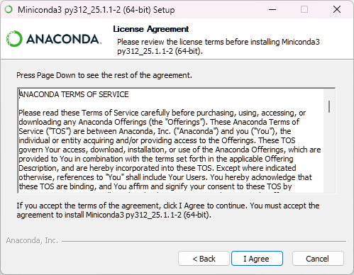
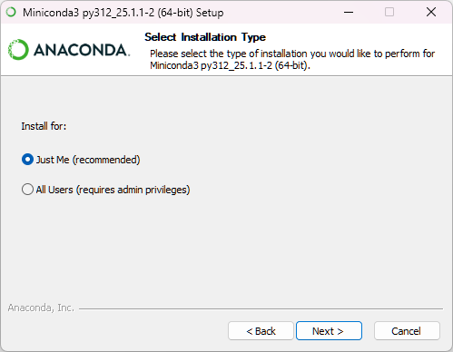
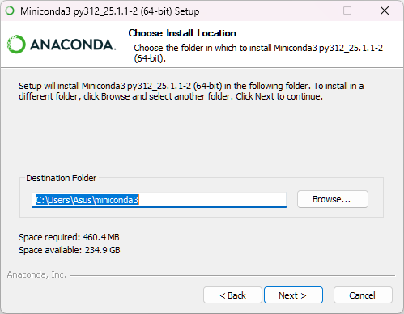
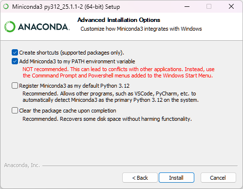
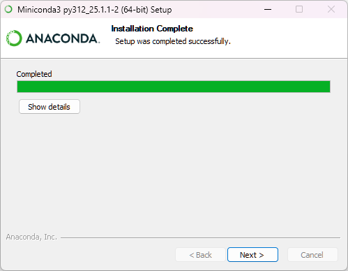
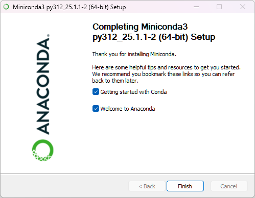

# พื้นฐาน Data Science และความสำคัญของข้อมูล

## ขั้นตอนการติดตั้งซอฟต์แวร์ที่จำเป็น

### การติดตั้ง Python 3.10 หรือใหม่กว่า

#### สำหรับ Windows

1. **ดาวน์โหลด Python**
   - เข้าไปที่เว็บไซต์ [Python.org](https://www.python.org/downloads/)
   - คลิกที่ปุ่ม "Download Python 3.10.x" (หรือเวอร์ชันล่าสุด)

2. **ติดตั้ง Python**
   - เปิดไฟล์ที่ดาวน์โหลดมา
   - เลือก "Add Python to PATH" ✓
   - คลิก "Install Now"
   - รอจนกระทั่งการติดตั้งเสร็จสมบูรณ์

3. **ตรวจสอบการติดตั้ง**
   - เปิด Command Prompt (หรือ PowerShell)
   - พิมพ์คำสั่ง `python --version` และกด Enter
   - ควรจะแสดงเวอร์ชันของ Python ที่ติดตั้ง เช่น "Python 3.10.x"

#### สำหรับ macOS

1. **ดาวน์โหลด Python**
   - เข้าไปที่เว็บไซต์ [Python.org](https://www.python.org/downloads/)
   - คลิกที่ปุ่ม "Download Python 3.10.x" (หรือเวอร์ชันล่าสุด)

2. **ติดตั้ง Python**
   - เปิดไฟล์ .pkg ที่ดาวน์โหลดมา
   - ทำตามขั้นตอนการติดตั้ง
   - รอจนกระทั่งการติดตั้งเสร็จสมบูรณ์

3. **ตรวจสอบการติดตั้ง**
   - เปิด Terminal
   - พิมพ์คำสั่ง `python3 --version` และกด Enter
   - ควรจะแสดงเวอร์ชันของ Python ที่ติดตั้ง เช่น "Python 3.10.x"

#### สำหรับ Linux

1. **ติดตั้ง Python**
   - เปิด Terminal
   - สำหรับ Ubuntu/Debian: `sudo apt update && sudo apt install python3.10`
   - สำหรับ Fedora: `sudo dnf install python3.10`
   - สำหรับ CentOS/RHEL: `sudo yum install python3.10`

2. **ตรวจสอบการติดตั้ง**
   - เปิด Terminal
   - พิมพ์คำสั่ง `python3 --version` และกด Enter
   - ควรจะแสดงเวอร์ชันของ Python ที่ติดตั้ง เช่น "Python 3.10.x"

### การติดตั้ง Miniconda

Miniconda เป็นตัวติดตั้ง Python ขนาดเล็กที่มาพร้อมกับระบบจัดการแพ็คเกจ conda ซึ่งช่วยให้คุณสามารถติดตั้งไลบรารี Python ที่ต้องการได้อย่างง่ายดาย และสร้างสภาพแวดล้อมแยกกัน (environments) สำหรับโปรเจ็คต่างๆ ได้

1. **ดาวน์โหลด Miniconda**
   - เข้าไปที่เว็บไซต์ [Anaconda.com](https://www.anaconda.com/download/success)
   - เลือกดาวน์โหลด Miniconda ที่เหมาะกับระบบปฏิบัติการของคุณ (ในหน้าดาวน์โหลดจะมีตัวเลือกให้ดาวน์โหลด Miniconda)
   
   


2. **ติดตั้ง Miniconda สำหรับ Windows**

   มี 2 วิธีในการติดตั้ง Miniconda บน Windows:

   **วิธีที่ 1: ติดตั้งด้วย Graphical Installer** (แนะนำสำหรับผู้ใช้ทั่วไป)
   - เปิดไฟล์ .exe ที่ดาวน์โหลดมา
   
   
   - เริ่มต้นการติดตั้ง

   

   - ทำตามขั้นตอนในตัวติดตั้งแบบกราฟิก

   

   - เลือกว่าจะติดตั้งสำหรับผู้ใช้เฉพาะคน (Just Me) หรือทุกคนในคอมพิวเตอร์ (All Users)

   

   - เลือกตำแหน่งที่ต้องการติดตั้ง Miniconda

   

   - **สำคัญ:** เลือก "Add Miniconda3 to my PATH environment variable" ✓ (ไม่ได้เลือกไว้เป็นค่าเริ่มต้น)

   

   - คลิก "Install"
   - รอจนกระทั่งการติดตั้งเสร็จสมบูรณ์

   

   - เมื่อติดตั้งเสร็จสมบูรณ์ คลิก "Next" และ "Finish"

   **วิธีที่ 2: ติดตั้งด้วย Command Prompt** (สำหรับผู้ใช้ขั้นสูง)
   - เปิด Command Prompt หรือ PowerShell ด้วยสิทธิ์ Administrator
   - นำทางไปยังโฟลเดอร์ที่มีไฟล์ติดตั้ง
   - รันคำสั่ง: `start /wait "" Miniconda3-latest-Windows-x86_64.exe /InstallationType=JustMe /RegisterPython=0 /S /D=%UserProfile%\Miniconda3`

   - **macOS/Linux**:
     - เปิด Terminal
     - ไปยังโฟลเดอร์ที่ดาวน์โหลดไฟล์มา
     - ทำให้สคริปต์ติดตั้งสามารถทำงานได้: `chmod +x Miniconda3-latest-*-x86_64.sh`
     - รันสคริปต์ติดตั้ง: `./Miniconda3-latest-*-x86_64.sh`
     - ทำตามคำแนะนำบนหน้าจอ

3. **ตรวจสอบการติดตั้ง**
   - หลังการติดตั้ง ให้เปิด Anaconda Prompt (สามารถค้นหาในเมนูเริ่มต้น)

   - พิมพ์คำสั่ง `conda --version` และกด Enter
   - ควรจะแสดงเวอร์ชันของ conda ที่ติดตั้ง

   - หากไม่ได้เลือกตัวเลือก "Add Miniconda3 to my PATH" ในขั้นตอนการติดตั้ง คำสั่ง conda จะใช้ได้เฉพาะใน Anaconda Prompt เท่านั้น ไม่สามารถใช้ใน Command Prompt ปกติ


## การสร้าง Conda Environment

หลังจากติดตั้ง Miniconda แล้ว เราควรสร้าง environment เฉพาะสำหรับโปรเจ็คนี้ ซึ่งจะช่วยแยกการติดตั้งไลบรารีต่างๆ ออกจากกัน เพื่อป้องกันปัญหาความขัดแย้งของไลบรารี

1. **สร้าง environment ใหม่**
   - เปิด Anaconda Prompt
   - พิมพ์คำสั่งต่อไปนี้เพื่อสร้าง environment ชื่อ `datascience` ที่มี Python 3.10:
   ```
   conda create -n datascience python=3.10
   ```
   - เมื่อมีการยืนยัน ให้พิมพ์ `y` และกด Enter

2. **เปิดใช้งาน environment**
   - หลังจากสร้าง environment แล้ว ให้เปิดใช้งานด้วยคำสั่ง:
   ```
   conda activate datascience
   ```
   - สังเกตว่าจะมีข้อความ `(datascience)` ปรากฏขึ้นที่ต้นบรรทัด
   
3. **ตรวจสอบ environment ที่สร้าง**
   - คุณสามารถดูรายการ environment ทั้งหมดได้ด้วยคำสั่ง:
   ```
   conda env list
   ```
   - และคุณสามารถดูรายการแพ็คเกจที่ติดตั้งใน environment ปัจจุบันได้ด้วยคำสั่ง:
   ```
   conda list
   ```

4. **เมื่อเสร็จสิ้นการใช้งาน**
   - เมื่อคุณเสร็จสิ้นการใช้งาน environment นี้ คุณสามารถออกจาก environment ด้วยคำสั่ง:
   ```
   conda deactivate
   ```

> **หมายเหตุ**: ทุกครั้งที่คุณต้องการทำงานกับโปรเจ็คนี้ ให้เปิดใช้งาน environment ก่อนด้วยคำสั่ง `conda activate datascience`

การสร้าง environment แยกต่างหากจะช่วยให้ติดตั้งไลบรารีเฉพาะที่ต้องการสำหรับโปรเจ็คนี้เท่านั้น และไม่ทำให้กระทบต่อการติดตั้งโปรแกรมอื่นๆ ในระบบ